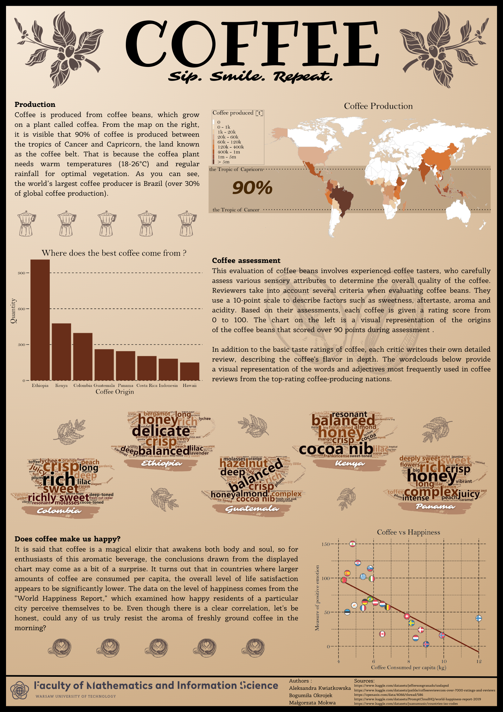

# Project: Coffee Data Visualization

### Project Description:
This project was completed as part of the "Data Visualization Techniques" course. The goal of the project was to create a poster containing data visualizations related to coffee. The data was collected and processed using the R language, and then used to create the poster using the Canva platform. The data used in the project was sourced from the Kaggle platform.

### Team Members:
- [Aleksandra Kwiatkowska](https://github.com/kwiatkowskaa)
- [Małgorzata Mokwa](https://github.com/malgosiam2)
- [Bogusia Okrojek](https://github.com/szostkawron)

### Tools Used:
- Programming Language: R
- Poster Creation Tool: Canva

### Project Structure:
- **kody/**: folder containing R scripts used for data processing and chart generation
- **Okrojek_Mokwa_Kwiatkowska.pdf**: poster in PDF format
- **Poster.png**: poster in PNG format
- **README.md**: this README file

